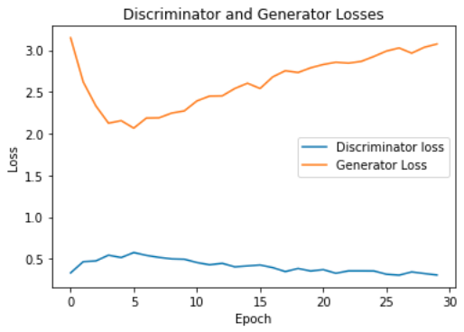

# GAN (Generative Adversarial Network) Projects

### GAN- MNIST
- [Code](https://github.com/WillMartin7/ai-basic-projects/blob/main/GAN/MNIST_GAN.py)
- Implementation of ["Generative Adversarial Networks"](https://arxiv.org/pdf/1406.2661.pdf) (Goodfell et al.)

### DCGAN (Deep Convolutional GAN)- MNIST
- [Code](https://github.com/WillMartin7/ai-basic-projects/blob/main/GAN/MNIST_DCGAN.py)
- Implementation of ["Unsupervised Representation Learning with Deep Convolutional Generative Adversarial Networks"](https://arxiv.org/pdf/1511.06434.pdf) (Radford et al.)

